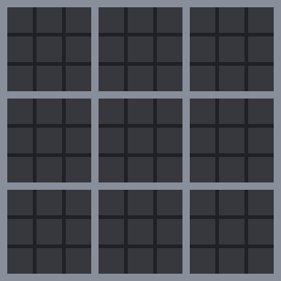

# HyperMorpion

### Description

HyperMorpion is a *mini-games* Discord bot originally created to implement the game of "hyper tic-tac-toe", a much more complex and ~~hard~~ fun version of Tic-tac-toe. 
It comes with French and English translations so far (people may help adding a new one in the future) and allows you to play HyperMorpion, Tic-tac-toe, and maybe other games in the future!

### Creation

This bot has been created from scratch by myself with the **discord.js**, **canvas** and **gifencoder** modules of **Node.js**.

### Adding HyperMorpion to a server

<!-- You can add it to your server using this link: -->
**EDIT: bot is currently offline until further development**

### Requirements

For a proper working, please give it the following permissions:
- Read Messages
- Send Messages
- Embed Links
- Attach Files
- Read Message History

### Feedback

For any suggestion, remark or correction, create an issue here or see the bot help.
Also, feel free to offer your help to add a new translation! You would of course get credited for it.

### Special thanks to

- Monke for her support and help
